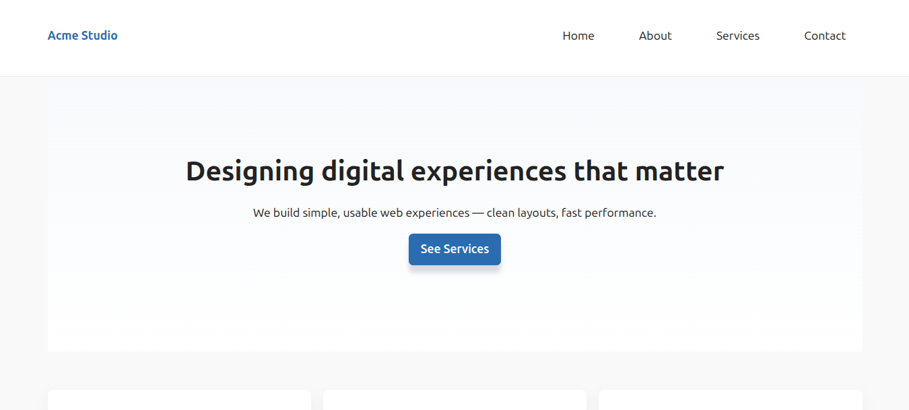
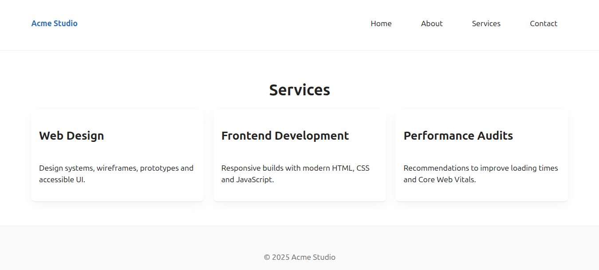
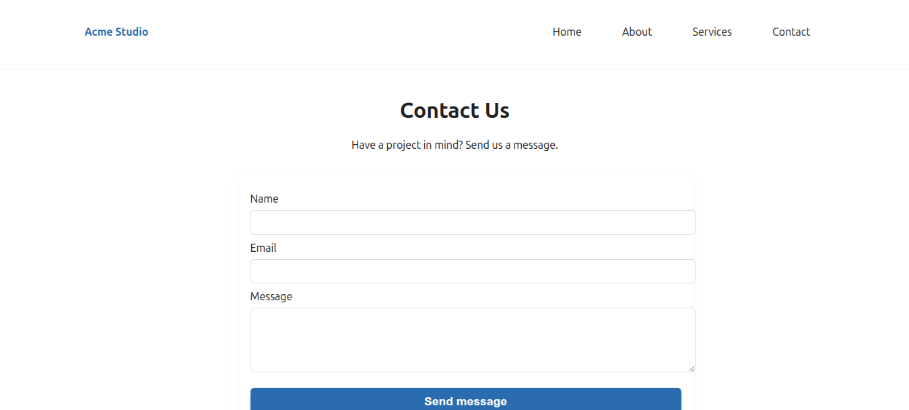

# Multipage Website — Acme Studio

A simple, responsive multipage website built with **HTML5, CSS3, and JavaScript**. The project demonstrates semantic structure, reusable layouts, and interactive elements suitable for a small portfolio, agency, or studio showcase.

---

## 🌐 Purpose
This website is designed as a **portfolio/product showcase** template for a creative studio. It includes:
- **Home Page** with hero, features, and gallery
- **About Page** with team profiles
- **Services Page** outlining offerings
- **Contact Page** with a working form (client-side validation)

---

## 📂 Project Structure
```
multipage-site/
│
├── index.html        # Home page
├──pages
     about.html        # About page
     services.html     # Services page
     contact.html      # Contact page
│
├── css/
│   └── style.css    # Global styles
│
├── js/
│   └── script.js       # Navigation, form validation, animations
│
├── images/           # Project images (hero, gallery, team)
│
└── README.md         # Documentation
```

---

## 🎨 Features
- **Responsive design** (mobile-first, flexible grids)
- **Sticky header + mobile nav toggle**
- **Hero section with CTA**
- **Feature cards and gallery**
- **Team profiles on About page**
- **Services overview page**
- **Contact form with validation** (name, email, message)
- **Subtle animations** (fade-up on scroll)
- **Reusable header/footer across pages**

---

## 🚀 Getting Started

### 1. Clone or Download
```bash
git clone https://github.com/VictorOduorKe/plp-webtechnologies-classroom-july2025-july-2025-final-project-and-deployment-Final-Project-and-Depl.git
cd multipage-site
```

### 2. Serve Locally
Use a static server of your choice:
```bash

# liver server
run with live server
```
Open [http://127.0.0.1:5500/](http://127.0.0.1:5500) in your browser.

---

## 🛠️ Customization
- Replace images in `/images/`
- Update text content in each `.html` page
- Adjust colors or layout in `css/styles.css`
- Add new pages by copying the structure of an existing page

---

## ✅ Best Practices
- Semantic HTML5 tags for accessibility
- Mobile-first CSS and responsive breakpoints
- Organized folder structure (`/css`, `/js`, `/images`)
- Clean, modular, and commented code
- Tested across screen sizes

---

## 📦 Deployment
You can deploy this website easily on:
- **Netlify** (drag-and-drop folder or connect repo)
- **Vercel**
- **GitHub Pages**
- **Any static web hosting service**

---
# LIve site
()[]
## 📸 Preview
home page


About


services


contact



---

## 📄 License
This project is open source. You may use, modify, and share it freely.
